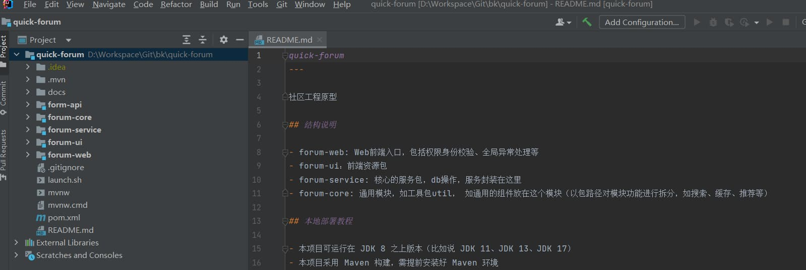

# 本地开发环境配置教程

## 1. 环境准备

首先准备好基础的开发环境，如

- jdk/jre: 请安装jdk8+以上版本
- maven: 本项目基于maven作为项目管理工具，因此在启动之前请配置好maven相关环境
- MySql数据库
  - 版本支持：5.x/8.x+
  - 说明：数据库可以使用本机的数据库，也可以使用非本机的（请注意本机能正常访问）
- git版本管理
- 开发工具：建议idea，当然eclipse/vs也没有问题

## 2. 项目启动

当环境准备完毕之后，接下来就是下载项目，导入开发工具进行启动演示

### 2.1 项目获取

本项目所有源码开源，因此您可以在github/gitee上免费获取

**通过git方式拉取项目**

```bash
# Git clone
git clone git@github.com:liuyueyi/quick-forum.git
git clone https://github.com/liuyueyi/quick-forum.git

# 若访问github有问题，可以使用gitee进行下载
git clone https://gitee.com/liuyueyi/quick-forum.git
```

**下载release包**

若希望从一个稳定的版本进行尝试，推荐在release页下载zip包，然后本机解压 

- [https://github.com/liuyueyi/quick-forum/releases](https://github.com/liuyueyi/quick-forum/releases)

### 2.2 项目导入

以IDEA开发工具为例

- File -> Open
- 选择第一步clone的项目工程

项目导入成功之后，会自动下载依赖、构建索引，此过程用时取决于您的机器性能+网速，通常会持续一段时间，请耐心等待；当完成之后，一个正常的项目工程如下图所示



### 2.3 配置修改